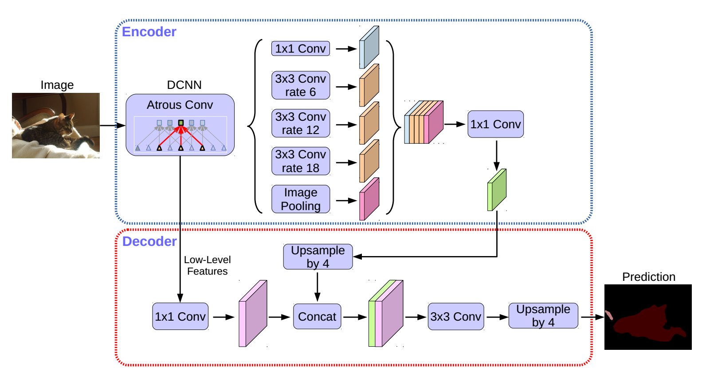

<!--
 * @Author: TJUZQC
 * @Date: 2020-11-25 16:12:55
 * @LastEditors: TJUZQC
 * @LastEditTime: 2020-11-26 12:53:47
 * @Description: None
-->
# Encoder-Decoder with Atrous Separable Convolution for Semantic Image Segmentation

DeepLabv3+ [2] 是DeepLab系列的最后一篇文章，其前作有 DeepLabv1, DeepLabv2, DeepLabv3.
在最新作中，作者通过encoder-decoder进行多尺度信息的融合，以优化分割效果，尤其是目标边缘的效果。
并且其使用了Xception模型作为骨干网络，并将深度可分离卷积(depthwise separable convolution)应用到atrous spatial pyramid pooling(ASPP)中和decoder模块，提高了语义分割的健壮性和运行速率，在 PASCAL VOC 2012 和 Cityscapes 数据集上取得新的state-of-art performance.

## Reference

> [Chen, Liang-Chieh, Yukun Zhu, George Papandreou, Florian Schroff, and Hartwig Adam. "Encoder-decoder with atrous separable convolution for semantic image segmentation." In Proceedings of the European conference on computer vision (ECCV), pp. 801-818. 2018.](https://arxiv.org/abs/1802.02611)

## Performance

### Cityscapes

| Model | Backbone | Resolution | Training Iters | mIoU | mIoU (multi-scale) | Links |
|:-:|:-:|:-:|:-:|:-:|:-:|:-:|
|DeepLabV3P|ResNet50_OS8|1024x512|80000|80.36%|-|[model](https://bj.bcebos.com/paddleseg/dygraph/cityscapes/deeplabv3p_resnet50_os8_cityscapes_1024x512_80k/model.pdparams) \| [log](https://bj.bcebos.com/paddleseg/dygraph/cityscapes/deeplabv3p_resnet50_os8_cityscapes_1024x512_80k/train.log) \| [vdl](https://paddlepaddle.org.cn/paddle/visualdl/service/app?id=860bd0049ba5495d629a96d5aaf1bf75)|
