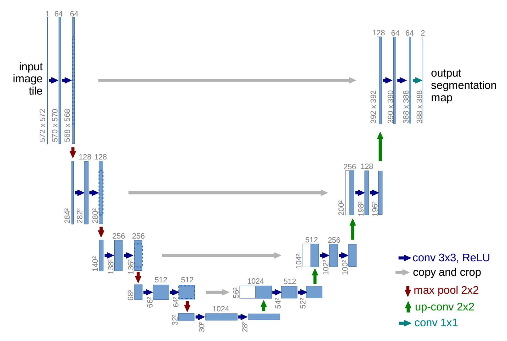

<!--
 * @Author: TJUZQC
 * @Date: 2020-11-25 16:12:55
 * @LastEditors: TJUZQC
 * @LastEditTime: 2020-11-26 12:51:21
 * @Description: None
-->
# U-Net: Convolutional Networks for Biomedical Image Segmentation

U-Net [1] 起源于医疗图像分割，整个网络是标准的encoder-decoder网络，特点是参数少，计算快，应用性强，对于一般场景适应度很高。U-Net最早于2015年提出，并在ISBI 2015 Cell Tracking Challenge取得了第一。经过发展，目前有多个变形和应用。

原始U-Net的结构如下图所示，由于网络整体结构类似于大写的英文字母U，故得名U-net。左侧可视为一个编码器，右侧可视为一个解码器。编码器有四个子模块，每个子模块包含两个卷积层，每个子模块之后通过max pool进行下采样。由于卷积使用的是valid模式，故实际输出比输入图像小一些。具体来说，后一个子模块的分辨率=(前一个子模块的分辨率-4)/2。U-Net使用了Overlap-tile 策略用于补全输入图像的上下信息，使得任意大小的输入图像都可获得无缝分割。同样解码器也包含四个子模块，分辨率通过上采样操作依次上升，直到与输入图像的分辨率基本一致。该网络还使用了跳跃连接，以拼接的方式将解码器和编码器中相同分辨率的feature map进行特征融合，帮助解码器更好地恢复目标的细节。

## Reference
> [Ronneberger O, Fischer P, Brox T. U-net: Convolutional networks for biomedical image segmentation[C]//International Conference on Medical image computing and computer-assisted intervention. Springer, Cham, 2015: 234-241.](https://arxiv.org/abs/1505.04597)

## Performance

### Cityscapes

| Model | Backbone | Resolution | Training Iters | mIoU | mIoU (multi-scale) | Links |
|:-:|:-:|:-:|:-:|:-:|:-:|:-:|
|UNet|-|1024x512|160000|62.20%|-|[model](https://paddleseg.bj.bcebos.com/dygraph/unet_cityscapes_1024x512_160k/model.pdparams) \| [log](https://paddleseg.bj.bcebos.com/dygraph/unet_cityscapes_1024x512_160k/train.log) \| [vdl](https://paddlepaddle.org.cn/paddle/visualdl/service/app?id=cbf444781f46612a30dbab5efc4d6715)|
