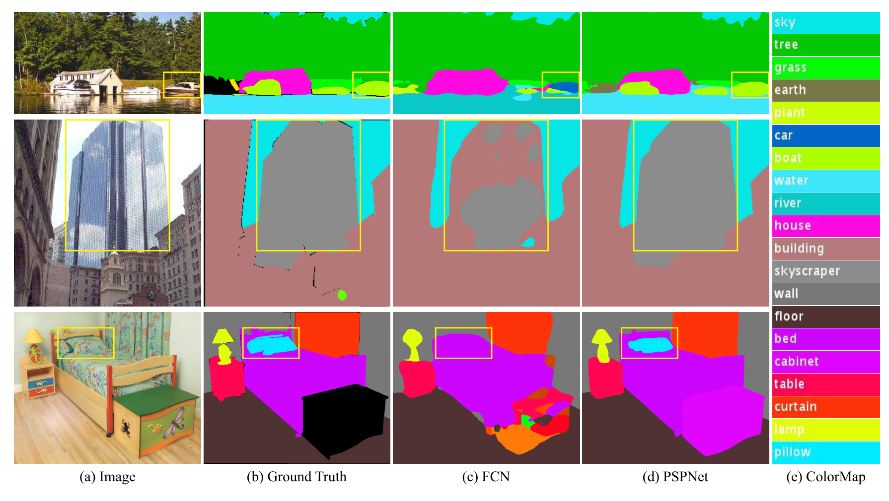
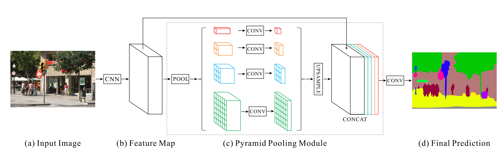

<!--
 * @Author: TJUZQC
 * @Date: 2020-11-25 16:12:55
 * @LastEditors: TJUZQC
 * @LastEditTime: 2020-11-26 12:55:37
 * @Description: None
-->
# Pyramid Scene Parsing Network

Pyramid Scene Parsing Network (PSPNet) [3] 起源于场景解析(Scene Parsing)领域。如下图所示，普通FCN [4] 面向复杂场景出现三种误分割现象：（1）关系不匹配。将船误分类成车，显然车一般不会出现在水面上。（2）类别混淆。摩天大厦和建筑物这两个类别相近，误将摩天大厦分类成建筑物。（3）类别不显著。枕头区域较小且纹理与床相近，误将枕头分类成床。

PSPNet的出发点是在算法中引入更多的上下文信息来解决上述问题。为了融合了图像中不同区域的上下文信息，PSPNet通过特殊设计的全局均值池化操作（global average pooling）和特征融合构造金字塔池化模块 (Pyramid Pooling Module)。PSPNet最终获得了2016年ImageNet场景解析挑战赛的冠军，并在PASCAL VOC 2012 和 Cityscapes 数据集上取得当时的最佳效果。整个网络结构如下：

## Reference

> [Zhao, Hengshuang, Jianping Shi, Xiaojuan Qi, Xiaogang Wang, and Jiaya Jia. "Pyramid scene parsing network." In Proceedings of the IEEE conference on computer vision and pattern recognition, pp. 2881-2890. 2017.](https://arxiv.org/abs/1612.01105)

## Performance

### Cityscapes

| Model | Backbone | Resolution | Training Iters | mIoU | mIoU (multi-scale) | Links |
|:-:|:-:|:-:|:-:|:-:|:-:|:-:|
|PSPNet|ResNet50_OS8|1024x512|80000|78.83%|-|[model](https://bj.bcebos.com/paddleseg/dygraph/cityscapes/pspnet_resnet50_os8_cityscapes_1024x512_80k/model.pdparams) \| [log](https://bj.bcebos.com/paddleseg/dygraph/cityscapes/pspnet_resnet50_os8_cityscapes_1024x512_80k/train.log) \| [vdl](https://paddlepaddle.org.cn/paddle/visualdl/service/app?id=2758d49b826d614abc53fb79562ebd10)|
|PSPNet|ResNet101_OS8|1024x512|80000|80.48%|-|[model](https://bj.bcebos.com/paddleseg/dygraph/cityscapes/pspnet_resnet101_os8_cityscapes_1024x512_80k/model.pdparams) \| [log](https://bj.bcebos.com/paddleseg/dygraph/cityscapes/pspnet_resnet101_os8_cityscapes_1024x512_80k/train.log) \| [vdl](https://paddlepaddle.org.cn/paddle/visualdl/service/app?id=899c080f0c38e0f5481e0dd28038bb6f)|
